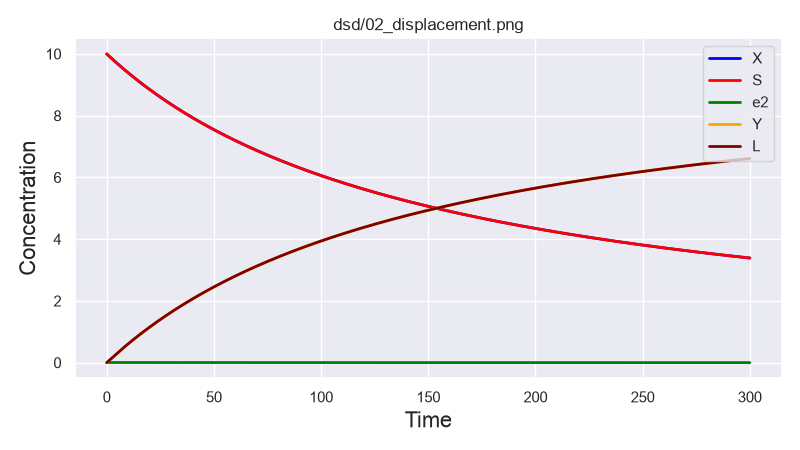
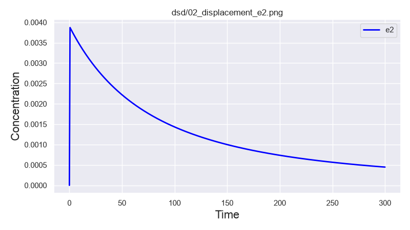

# Experiment 2: Toehold-Mediated DNA Strand Displacement

## Objective

The goal of this experiment was to simulate a genuine **toehold-mediated strand displacement reaction**.

In the previous experiment, two complementary strands simply associated:

$$
A + B \rightarrow AB
$$

This experiment introduces a more computationally useful mechanism:

1. an input strand binds to an exposed **toehold**;
2. a transient multi-strand complex is formed;
3. branch migration occurs;
4. a previously bound strand is displaced and released as a free molecular output.

The system used here is based on a strand-displacement design from the Peppercorn case studies, which in turn references the experimental work of **David Yu Zhang and Erik Winfree (2009), _Control of DNA Strand Displacement Kinetics Using Toehold Exchange_**.

The original paper experimentally studied how short DNA toeholds control strand-displacement kinetics and modeled these processes using a multi-step kinetic description.


# System Design

The system contains five relevant molecular species:

- `X` — invading input strand
- `S` — substrate / gate complex
- `e2` — transient strand-displacement intermediate
- `Y` — released output strand
- `L` — final complex after successful displacement

Initial concentrations were:

$[X]$ $(0) = 10\ \mathrm{nM}$

$[S]$ $(0) = 10\ \mathrm{nM}$

$[Y] $(0) = 0$

$[L]$ $(0) = 0$

$[e2]$ $(0) = 0$

The DNA system was specified at the **domain level**, rather than using explicit nucleotide sequences.

For example, the toehold domain had length:

$$
|ct| = 5\ \mathrm{nt}
$$

while the other recognition and migration domains were longer.

At this stage, domains such as `ct`, `b`, `br`, and `b6` represent logical DNA sequence regions, not concrete nucleotide sequences such as:

```text
ACTGCC...
```

---

# Peppercorn Reaction Enumeration

Peppercorn analyzed the domain-level structures and discovered the following reaction network:

$$
S + X \xrightarrow{k_{\text{bind}}} e2
$$

$$
e2 \xrightarrow{k_{\text{open}}} S + X
$$

$$
e2 \xrightarrow{k_{\text{branch}}} Y + L
$$

with predicted domain-level rate constants:

$$
k_{\text{bind}} = 0.0015\ \mathrm{nM}^{-1}\mathrm{s}^{-1}
$$

$$
k_{\text{open}} = 21.7651\ \mathrm{s}^{-1}
$$

$$
k_{\text{branch}} = 16.6667\ \mathrm{s}^{-1}
$$

Peppercorn classified the reactions as:

```text
bind21
open
branch-3way
```

respectively.

---

# Interpretation of the Mechanism

## Step 1: Toehold Binding

The input strand `X` first binds to an exposed complementary toehold on the gate `S`.

$$
S + X \rightarrow e2
$$

This is a bimolecular reaction, so under mass-action kinetics:

$$
r_{\text{bind}} = k_{\text{bind}}[S][X]
$$

At the beginning of the experiment:

$[S] $(0)$ = $[X]$ $(0) = 10\ \mathrm{nM}$

therefore:

$$
r_{\text{bind}}(0) = 0.0015 \times 10 \times 10
$$

and:

$$
\boxed{r_{\text{bind}}(0) = 0.15\ \mathrm{nM/s}}
$$

The product `e2` is a transient multi-strand complex.

---

## Step 2: Competing Outcomes of the Intermediate

Once `e2` has formed, it has two possible outcomes.

### Path A: Dissociation

The input may simply detach again:

$$
e2 \rightarrow S + X
$$

with:

$$
k_{\text{open}} = 21.7651\ \mathrm{s}^{-1}
$$

In this case, no computation is completed and no output is released.

The system returns to its original state:

```text
S + X
  ↓
 e2
  ↓
S + X
```

---

## Step 3: Three-Way Branch Migration

Alternatively, `X` can continue competing for the substrate through **3-way branch migration**.

The displacement eventually releases `Y`:

$$
e2 \rightarrow Y + L
$$

with:

$$
k_{\text{branch}} = 16.6667\ \mathrm{s}^{-1}
$$

Conceptually:

```text
Input X binds
      ↓
transient complex
      ↓
branch migration
      ↓
old strand Y is displaced
      ↓
Y becomes a free molecular signal
```

This is the important computational event.

The released `Y` strand could, in principle, become the input to another downstream DNA gate.

---

# Reaction Network

The complete effective mechanism is:

```text
                     k_open
                  ┌──────────→ S + X
                  │
S + X ──k_bind──→ e2
                  │
                  └──────────→ Y + L
                     k_branch
```

This differs fundamentally from the previous hybridization experiment.

Previously:

```text
A + B → duplex
```

was essentially the entire reaction.

Here, binding only creates an intermediate state. The system must then choose between:

- returning to the initial state;
- completing strand displacement and releasing output.

---

# Probability of Successful Displacement

Because the two unimolecular reactions compete from the same transient state `e2`, we can estimate the probability that a newly formed `e2` complex proceeds directly to successful strand displacement.

For two competing exponential processes:

$$
P_{\text{success}} = \frac{k_{\text{branch}}}{k_{\text{branch}} + k_{\text{open}}}
$$

Substituting the Peppercorn rates:

$$
P_{\text{success}} = \frac{16.6667}{16.6667 + 21.7651}
$$

Therefore:

$$
\boxed{P_{\text{success}} \approx 0.434}
$$

So approximately:

$$
43.4\%
$$

of individual `e2` intermediates are expected to proceed to `Y + L` before dissociating.

The remaining approximately:

$$
56.6\%
$$

return to:

$$
S + X
$$

This does **not** mean that the final strand-displacement yield is limited to 43%.

If the intermediate dissociates, `S` and `X` remain available and may bind again. Repeated attempts allow the reaction to continue toward product formation.

---

# Effective Rate Approximation

A simple approximation for the effective successful bimolecular reaction is:

$$
S + X \rightarrow Y + L
$$

If every binding event succeeds with probability $P_{\text{success}}$, then an approximate effective rate constant is:

$$
k_{\text{eff}} \approx k_{\text{bind}} P_{\text{success}}
$$

Thus:

$$
k_{\text{eff}} \approx 0.0015 \times 0.43367
$$

and:

$$
\boxed{k_{\text{eff}} \approx 6.51\times10^{-4}\ \mathrm{nM}^{-1}\mathrm{s}^{-1}}
$$

This simplified effective model approximates the full Peppercorn/Pilsimulator trajectory surprisingly well.

For equal initial concentrations:

$[X]$ $(0)$ = $[S]$ $(0) = C_0 = 10\ \mathrm{nM}$

an irreversible second-order approximation gives:

$[X]$ $(t) \approx [S]$ $(t) \approx \frac{C_0}{1+k_{\text{eff}}C_0t}$

and therefore:

$[Y]$ $(t) \approx C_0 - \frac{C_0}{1+k_{\text{eff}}C_0t}$

At:

$$
t = 300\ \mathrm{s}
$$

this predicts approximately:
$[Y]$ $(300) \approx 6.61\ \mathrm{nM}$


The Pilsimulator result was approximately:

$[Y]$ $(300) \approx 6.6\ \mathrm{nM}$

showing close agreement between the simple effective model and the explicitly enumerated reaction network.

---

# Simulation with Pilsimulator

Peppercorn generated the reaction network, and Pilsimulator numerically integrated the resulting chemical kinetics.

The simulation tracked:

- $[X]$ $(t)$ — invading input strand
- $[S]$ $(t)$ — substrate / gate
- $[e2]$ $(t)$ — transient intermediate
- $[Y]$ $(t)$ — released output strand
- $[L]$ $(t)$ — final displaced complex

The simulation interval was:

$$
0 \leq t \leq 300\ \mathrm{s}
$$

---

# Main Concentration Trajectories

The simulation showed that:

$[X]$ $(t) \approx [S]$ $(t)$

because each successful strand displacement consumes one `X` and one `S`.

Similarly:

$[Y]$ $(t) \approx [L]$ $(t)$

because each successful strand-displacement event produces one `Y` and one `L`.

At approximately $t=300\ \mathrm{s}$:

$$
[X] \approx [S] \approx 3.4\ \mathrm{nM}
$$

and:

$$
[Y] \approx [L] \approx 6.6\ \mathrm{nM}
$$

This is consistent with conservation of material:

$[X]$ $(t) + [Y]$ $(t) \approx 10\ \mathrm{nM}$

and:

$[S]$ $(t) + [L]$ $(t) \approx 10\ \mathrm{nM}$

---

## Figure 1 — Full Strand-Displacement Dynamics



The input species `X` and gate species `S` decrease over time.

The output strand `Y` and final complex `L` accumulate.

The transient intermediate `e2` appears to remain at approximately zero on this plot because its concentration is several orders of magnitude smaller than the main species.

---

# Transient Intermediate `e2`

Peppercorn classified `e2` as a **transient complex** rather than a resting complex.

This means that once it forms, it rapidly exits through either:

$$
e2 \rightarrow S + X
$$

or:

$$
e2 \rightarrow Y + L
$$

The total first-order rate of leaving `e2` is:

$$
k_{\text{out}} = k_{\text{open}} + k_{\text{branch}}
$$

Therefore:

$$
k_{\text{out}} = 21.7651 + 16.6667
$$

and:

$$
\boxed{k_{\text{out}} = 38.4318\ \mathrm{s}^{-1}}
$$

The corresponding characteristic timescale is approximately:

$$
\tau \sim \frac{1}{k_{\text{out}}}
$$

so:

$$
\tau \approx \frac{1}{38.4318}
$$

and:

$$
\boxed{\tau \approx 0.026\ \mathrm{s}}
$$

Thus the lifetime of the intermediate is on the order of tens of milliseconds, while the overall strand-displacement process evolves over hundreds of seconds.

This separation of timescales explains why `e2` remains at very low concentration.

---

# Quasi-Steady-State Approximation

Because `e2` forms slowly but disappears rapidly, it can approximately satisfy a **quasi-steady-state condition**:

$$
\frac{d [e2] }{dt} \approx 0
$$

The full intermediate equation is:

$$
\frac{d [e2] }{dt}
=
k_{\text{bind}}[S][X]
-
(k_{\text{open}}+k_{\text{branch}})[e2]
$$

Setting the derivative approximately to zero gives:

$$
k_{\text{bind}}[S][X]
\approx
(k_{\text{open}}+k_{\text{branch}})[e2]
$$

Therefore:

$$
\boxed{
[e2]
\approx
\frac{k_{\text{bind}}[S][X]}
{k_{\text{open}}+k_{\text{branch}}}
}
$$

At the beginning:

$[S]$ $(0)=[X]$ $(0)=10\ \mathrm{nM}$

so:

$$
[e2]
\approx
\frac{0.0015\times10\times10}
{38.4318}
$$

and:

$$
\boxed{[e2] \approx 0.00390\ \mathrm{nM}}
$$

The dedicated Pilsimulator plot showed a peak of approximately:

$$
0.0039\ \mathrm{nM}
$$

which closely matches this analytical estimate.

---

## Figure 2 — Transient Intermediate `e2`



The intermediate concentration rapidly rises to approximately:

$$
0.0039\ \mathrm{nM}
$$

and then slowly decreases.

The slow decline is not caused by a changing molecular mechanism.

Instead:

$$
[e2] \propto [X][S]
$$

As `X` and `S` are gradually consumed:

$$
[X]\downarrow
$$

and:

$$
[S]\downarrow
$$

the rate of forming new `e2` complexes also decreases.

For example, near the end of the simulation:

$$
[X] \approx [S] \approx 3.4\ \mathrm{nM}
$$

The quasi-steady-state approximation predicts:

$[e2]$ $$ 
\approx
\frac{0.0015\times3.4\times3.4}
{38.4318}
$$

or approximately:

$[e2]$ $\approx 4.5\times10^{-4}\ \mathrm{nM}$

which is consistent with the simulated trajectory.

---

# Assumptions

Several important assumptions are present in this experiment.

## 1. Domain-Level Rather Than Sequence-Level Modeling

The model specifies DNA using abstract domains:

```text
ct
b
br
b6
...
```

rather than actual nucleotide sequences.

Therefore, the simulation captures structural reaction semantics but not all sequence-specific effects.

The model does not yet explicitly evaluate phenomena such as:

- sequence-specific hybridization energies
- hairpin formation
- unintended sequence-level crosstalk
- mismatch effects
- salt-dependent sequence thermodynamics

---

## 2. Peppercorn Rate Model

The rate constants used in this experiment were generated by Peppercorn's domain-level kinetic model.

They should therefore be interpreted as **model predictions**, not as experimentally measured kinetic constants for a particular set of oligonucleotide sequences.

At this stage, we are studying domain-level behavior rather than validating a concrete nucleotide-level implementation.

---

## 3. Mass-Action Kinetics

The simulation assumes well-mixed mass-action kinetics.

For example:

$$
r_{\text{bind}} = k_{\text{bind}}[S][X]
$$

This assumes that:

- molecules are uniformly mixed;
- diffusion does not create important spatial gradients;
- concentrations are large enough for a deterministic ODE description to be reasonable.

---

## 4. No Explicit Sequence-Level Leakage

Only reactions discovered by the domain-level enumerator contribute to the simulated kinetics.

Sequence-specific undesired interactions that would emerge only after choosing concrete DNA sequences are not yet represented.

---

## 5. Deterministic Concentrations

Pilsimulator integrates deterministic concentration trajectories.

Individual molecular reaction events are stochastic, but fluctuations are averaged out in this model.

For sufficiently small reaction volumes or molecule counts, a stochastic simulator could become more appropriate.

---

# What We Learned

## 1. Binding Is Not the Same as Computation

In the previous experiment, binding itself produced the final complex.

In strand displacement:

$$
\text{binding} \neq \text{successful output}
$$

Binding creates a transient state from which the system may either:

- return to the initial state;
- proceed to the computationally useful output.

---

## 2. Molecular Computation Contains Competing Reaction Paths

The same intermediate can have multiple possible outcomes:

$$
e2 \rightarrow S + X
$$

or:

$$
e2 \rightarrow Y + L
$$

Therefore computation is inherently kinetic and probabilistic at the level of individual molecular events.

The useful macroscopic result emerges from a large population of molecules undergoing repeated reaction attempts.

---

## 3. Intermediate Species Can Remain Almost Invisible

A molecular intermediate can play a critical mechanistic role while remaining at extremely low concentration.

Here:

$$
[e2]_{\max} \approx 0.0039\ \mathrm{nM}
$$

while the main species were initially present at:

$$
10\ \mathrm{nM}
$$

Thus an intermediate may control the entire reaction pathway without accumulating appreciably.

---

## 4. Separation of Timescales Enables Simplification

The intermediate evolves on a timescale of approximately:

$$
0.026\ \mathrm{s}
$$

while the overall conversion occurs over hundreds of seconds.

This allows the intermediate to be approximated using quasi-steady-state analysis and the full reaction network to be approximated by an effective reaction:

$$
S + X \rightarrow Y + L
$$

---

## 5. A Complex Molecular Mechanism Can Produce a Simple Effective Computation

The detailed mechanism is:

$$
S + X \rightarrow e2
$$

followed by the competing reactions:

$$
e2 \rightarrow S + X
$$

and:

$$
e2 \rightarrow Y + L
$$

Yet on longer timescales it behaves approximately like:

$$
S + X \rightarrow Y + L
$$

with:

$$
k_{\text{eff}}
\approx
6.51\times10^{-4}\ \mathrm{nM}^{-1}\mathrm{s}^{-1}
$$

This is an important idea for molecular computing:

> Complex microscopic dynamics can produce much simpler effective computational primitives.

---

## 6. A Released DNA Strand Can Represent an Output Signal

The most important conceptual difference from simple hybridization is that `Y` is released as a **free strand**.

Therefore, it can act as a molecular signal:

```text
X
↓
Gate S
↓
strand displacement
↓
Y
↓
next gate
↓
Z
```

This ability to cascade molecular reactions is one of the foundations of DNA strand-displacement computing.

---

# Relation to Zhang & Winfree (2009)

Zhang and Winfree experimentally studied how DNA toeholds control the kinetics of strand displacement and toehold exchange.

Their work showed that short single-stranded toeholds can be used to tune molecular reaction kinetics and modeled strand displacement using a small number of kinetic steps.

Our experiment does **not** reproduce their experimental fluorescence measurements, exact nucleotide sequences, or complete experimental conditions.

Instead, we used a Peppercorn domain-level case-study representation inspired by that work to reproduce the underlying strand-displacement mechanism computationally:

```text
toehold binding
      ↓
transient complex
      ↓
branch migration
      ↓
output strand release
```

Reference:

David Yu Zhang and Erik Winfree.  
**Control of DNA Strand Displacement Kinetics Using Toehold Exchange.**  
*Journal of the American Chemical Society*, 131(47), 17303–17314 (2009).  
DOI: `10.1021/ja906987s`

---

# Current Computational Pipeline

We can now describe the workflow as:

```text
domain-level DNA design
        ↓
     Peppercorn
        ↓
reaction enumeration
        ↓
bind / open / branch migration
        ↓
    Pilsimulator
        ↓
ODE integration
        ↓
concentration trajectories
        ↓
mechanistic and kinetic analysis
```

This is a significant step beyond the earlier abstract CRN experiments because the reaction network is no longer manually invented.

It is derived from the structure of a DNA strand-displacement system.

---

# Next Experiment

The next experiment will modify the **toehold length**:

$$
|ct|
$$

while keeping the rest of the circuit architecture approximately unchanged.

For example:

```text
ct = 2 nt
ct = 3 nt
ct = 4 nt
ct = 5 nt
ct = 6 nt
ct = 7 nt
```

For each design, we can measure:

- $k_{\text{bind}}$
- $k_{\text{open}}$
- $k_{\text{branch}}$
- $k_{\text{eff}}$
- the time required to reach a chosen output concentration

For example:

$$
[Y] = 5\ \mathrm{nM}
$$

This will turn the next experiment from pure observation into our first **DNA circuit engineering experiment**:

$$
\boxed{
\text{DNA design parameter}
\rightarrow
\text{reaction kinetics}
\rightarrow
\text{computational performance}
}
$$
